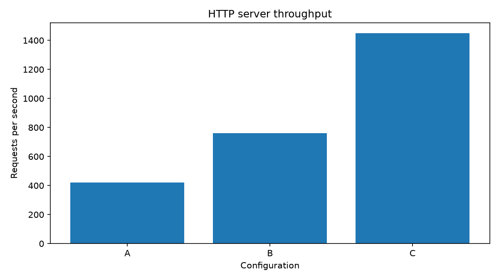

# Автоматически рассчитанные результаты

Все значения — демонстрационные, а не реальные измерения.

## Сводная таблица

| Метрика | A | B | C |
|---|---:|---:|---:|
| Среднее время ответа, мс | 90.0 | 100.0 | 55.0 |
| 95-й перцентиль, мс | 210.0 | 130.0 | 65.0 |
| Пропускная способность, запросов/с | 420 | 760 | 1450 |
| Ошибки, % | 0.8 | 0.5 | 0.2 |

## Пропускная способность

## Сравнение с конфигурацией A

| Конфигурация | Снижение среднего времени, % | Прирост пропускной способности, % |
|---|---:|---:|
| A | 0.0 | 0.0 |
| B | -11.1 | 81.0 |
| C | 38.9 | 245.2 |

## Метаданные сборки

- Git commit: `928d328af01011318eaffc9f8e3655415d5cf73e`
- Дата сборки: `2026-10-09 12:08:10 UTC`
- Версия набора данных: `v1.0`
- SHA-256 набора данных: `1a34edc2cb7e`
- Кэш: `MISS — выполнен пересчёт`
